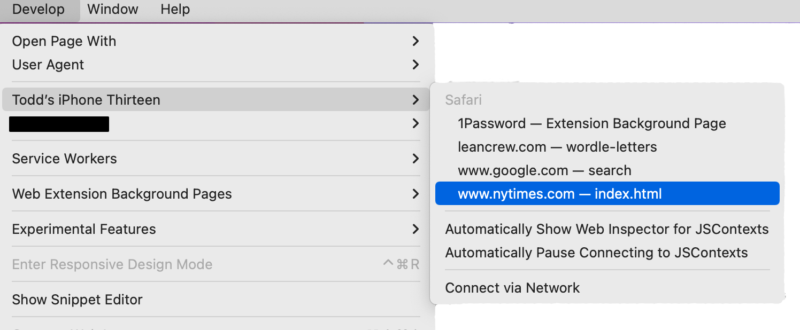
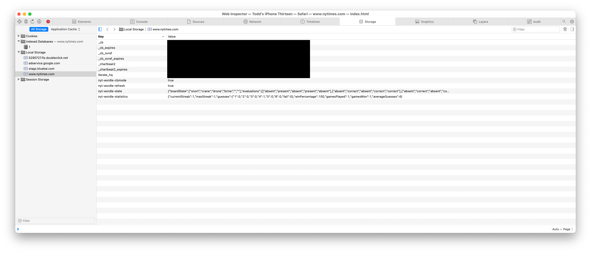
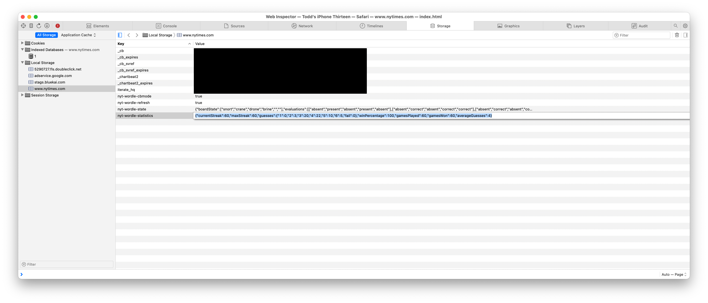

# How to manually update or fix your Wordle stats on an iPhone or iPad

My iPhone's browser history for nytimes.com accidentally got cleared, which erased my Wordle stats, because those stats are only stored in a browser's local storage and not on a server. Thankfully I've been paranoid about this very possibility and I had taken a screenshot of my stats just the day before. I was desperate to have my stats back and successfully figured out a way to do so.

Now, one could use this to cheat and modify your stats to something you did not earn, but what fun is being a cheater? So don't do that.

This is an advanced procedure best done by someone who is pretty technically savvy and understands client-side web technologies. If this doesn't describe you, I can't help you personally, but maybe you know a developer or engineer who has the skills to follow these steps.

## Here's what I did

I'm going to say "iPhone" in these instructions since that's what I was using, but theoretically this could apply to an iPad, too.

### Requirements

* A Mac 
* A lightning cable to connect your Mac to your iPhone

### Steps

* On your iPhone, go to Settings -> Safari -> Advanced -> Enable "Web Inspector".
* Connect your iPhone to your computer via the lightning cable. You may be prompted on your phone to trust this computer, which you'll need to do in order to complete these steps.
* Open Safari on your Mac, go to Safari -> Preferences -> Advanced and check "Show Develop menu in menu bar".
* Open the Wordle site on your iPhone.
* In Safari on your Mac, go to Develop -> (your phone name) -> nytimes. This will open a web inspector on your Mac.

  * In the web inspector, go to the Storage tab.
  * Expand the Local Storage triangle.
  * Under Local Storage, select "www.nytimes.com".
 
  * Look for the Key "nyt-wordle-statistics". The value associated with this key is a JSON representation of your stats, for example:
```{"currentStreak":60,"maxStreak":60,"guesses":{"1":0,"2":3,"3":20,"4":22,"5":10,"6":5,"fail":0},"winPercentage":100,"gamesPlayed":60,"gamesWon":60,"averageGuesses":4}```

  * Update this JSON to reflect the correct stats. If you're not familiar with JSON, you need to do this carefully -– a mistake here could corrupt the data!
  * After updating this value, the stats should be correct on your phone again.
  
